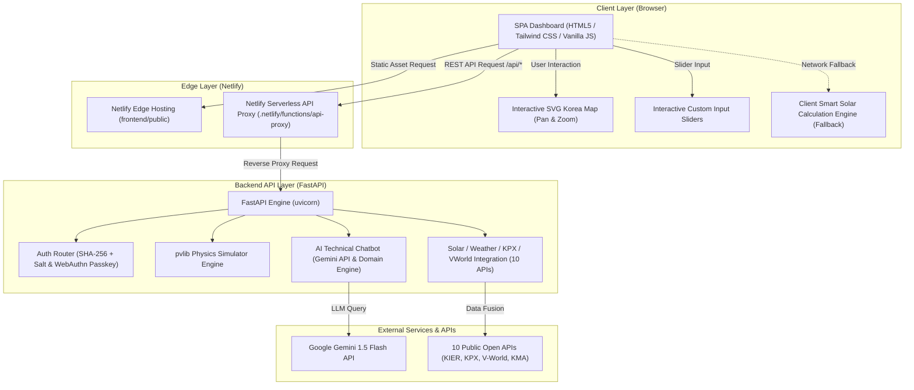

# ☀️ 햇빛 발전소 (E-SolarSpot)
> **도심형 소규모 분산에너지(태양광) 입지 분석, 일사량 지도 & 3D 음영·물리 발전량 시뮬레이터**


---

## 📌 1. 프로젝트 개요 (Overview)

**햇빛 발전소 (E-SolarSpot)**는 도심형 건물 및 주택에 설치되는 소규모 태양광 분산에너지의 입지 적합성을 분석하고, 실시간 일사량 지도와 3D 음영/물리 시뮬레이션을 제공하는 **태양광 발전 시뮬레이션 & 경제성 진단 웹 플랫폼**입니다.

사용자는 지도에서 원하는 지역을 클릭하거나 설비 용량, 설치 경사각, 음영 비율, 유지비 등의 커스텀 변수를 대화형 슬라이더 UI로 조절하여 **연간 예상 발전량(kWh)**, **2026년 지자체 지원금 환산액**, **SMP/REC 정산 수익 및 ROI(투자 회수 기간)**를 즉시 입체적으로 시각화하여 확인할 수 있습니다.

---

## ✨ 2. 주요 기능 (Key Features)

### 🗺️ 1) 인터랙티브 대한민국 일사량 지도 엔진
- 전국 17개 주요 지자체별 실시간/연간 일사량(kWh/m²) 및 일평균 일조시간 데이터 시각화
- SVG 한반도 윤곽선(제주도, 울릉도, 독도 포함) 기반의 부드러운 드래그(Pan) & 확대/축소(Zoom) 지형 탐색 기능
- 일사량 등급(1,450+ kWh/m² 최우수 1등급 등) 컬러 범례 오버레이 및 월별 발전량 추이 차트 연동

### ☀️ 2) 3D 음영 & pvlib 물리 발전량 시뮬레이터
- `pvlib` 파이썬 물리 엔진을 활용하여 모듈 경사각(Tilt 30°), 방위각(Azimuth 180°), 구조물 그늘(Shadow Ratio), 기온 손실 계수를 반영한 발전 수율 정밀 산출
- 기상청 ASOS 최신 외기온도 및 풍속 데이터를 결합한 셀 온도 감쇄 보정 모델링

### 💰 3) 2026 대한민국 지자체 지원금 & ROI 계산기
- 서울, 경기, 전남, 경북 등 주요 지자체별 3kW 주택/건물용 태양광 국비 및 지방비 지원 단가 자동 반영
- 계통한계가격(SMP)과 신재생에너지 공급인증서(REC) 실시간 단가를 조합한 연간 예상 정산 수익률 계산
- 커스텀 변수(설치비, 유지비, 용량 등) 슬라이더 조절 시 대화형 라이브 재계산

### 🎧 4) AI 기술 상담원 & 4단계 Zero-Downtime 무장애 엔진
- Google Gemini API 연동을 통한 태양광 설치, 공공 API 파이프라인, 보조금 문의에 관한 실시간 AI 대화 상담
- 외부 LLM API 통신 장애 발생 시에도 클라이언트/서버 3D 물리연산 엔진이 즉시 정확한 수치를 자동 계산하는 **4단계 무장애(Zero-Downtime) Fallback 구조** 구축

### 🔐 5) 안전한 사용자 인증 & FIDO2 Passkey / 서버리스 연동
- SHA-256 + Salt 원웨이 해싱 보안 알고리즘 기반 회원가입 및 로그인
- FIDO2 WebAuthn Passkey (지문, Touch ID, Face ID, Windows Hello) 생체 인증 지원
- Netlify Serverless Functions API Proxy를 통한 CORS 안전 백엔드 통신

---

## 🏗️ 3. 아키텍처 및 시스템 구조 (Architecture)



---

## 🛠️ 4. 기술 스택 (Tech Stack)

### Frontend
- **Language**: HTML5, JavaScript (ES6+)
- **Styling**: Tailwind CSS (CDN / Utility-first)
- **Visualization**: Interactive Vector SVG Map, Chart.js, Canvas 2D Engine

### Backend
- **Framework**: Python 3.12+, FastAPI, Uvicorn
- **Physics Engine**: `pvlib` (Solar Energy System Modeling)
- **Data & Math**: Pandas, NumPy, Pydantic v2
- **HTTP Client**: HTTPX (Asynchronous Client)

### AI & Security
- **AI Model**: Google Gemini API (`gemini-1.5-flash`), NVIDIA NIM API Fallback
- **Security**: SHA-256 + Salt Password Hashing, FIDO2 WebAuthn Passkey, CORS Security Headers

### Deployment & Hosting
- **Hosting & Proxy**: Netlify (Frontend Static + Serverless API Proxy)
- **API Server**: FastAPI / Uvicorn ASGI Server

---

## 📂 5. 디렉토리 구조 (Directory Structure)

```text
solar_V23/
├── backend/
│   ├── app/
│   │   ├── api/          # FastAPI 엔드포인트 (Auth, Solar, KPX, Weather, Simulation, Chat)
│   │   ├── core/         # 환경 변수 및 공통 Config 설정 (SHA-256 Auth, WebAuthn)
│   │   ├── services/     # pvlib 물리 계산 서브모듈 (pvlib_engine.py)
│   │   ├── static/       # 백엔드 서빙 정적 자원 (Sync with Frontend)
│   │   └── main.py       # FastAPI 앱 진입점
│   └── requirements.txt  # 백엔드 의존성 레포지토리
├── frontend/
│   └── public/
│       ├── index.html    # 대시보드 단일 페이지 웹 애플리케이션 (SPA)
│       ├── est로고1.svg   # 서비스 브랜드 SVG 로고
│       └── favicon.svg   # 브라우저 아이콘
├── netlify/
│   └── functions/
│       └── api-proxy.js  # Netlify 서버리스 API 프록시 라우팅
└── netlify.toml          # Netlify 빌드 및 헤더/리다이렉트 설정
```

---

## 🚀 6. 실행 방법 (Getting Started)

### Prerequisites
- Python 3.10 이상
- Node.js (Netlify CLI 선택 사항)

### 1) Backend 실행 (Local FastAPI Server)

```bash
# 1. 백엔드 디렉토리 이동
cd backend

# 2. 가상환경 생성 및 활성화 (Windows 기준)
python -m venv venv
.\venv\Scripts\activate

# 3. 필요 패키지 설치
pip install -r requirements.txt

# 4. FastAPI 개발 서버 실행 (Port 8000)
python -m uvicorn app.main:app --reload --port 8000
```
> 서버가 실행되면 `http://localhost:8000/docs`에서 **Swagger UI**를 통해 10개 이상의 API 명세를 직접 테스트할 수 있습니다.

### 2) Frontend 실행

- `frontend/public/index.html` 파일을 웹 브라우저로 직접 열거나 VS Code Live Server 확장 프로그램을 사용하여 실행할 수 있습니다.

---

## 💡 7. 포트폴리오 기술적 강점 (Portfolio Highlights)

1. **태양광 전문 물리 엔진(`pvlib`) 기반 수학적 발전량 모델링**
   - 단순 기온/일사량 곱셈 공식이 아닌, 태양 고도각, Azimuth, 모듈 경사각, 음영 마스크 및 기온에 따른 셀 효율 저하를 고려한 태양광 발전량 산출 시뮬레이션 구현

2. **반응형 인터랙티브 SVG 한반도 지도 엔진 구현**
   - 외부 무거운 지도 라이브러리 의존 없이 순수 SVG Vector Graphic과 Transform 좌표 계산 알고리즘을 구축하여 부드러운 드래그(Pan) & 스케일(Zoom) 성능 확보

3. **4단계 무장애(Zero-Downtime) Dual Engine AI 상담 시스템**
   - Gemini API → NVIDIA API → 서버 스마트 연산 엔진 → 클라이언트 JS 스마트 연산 엔진으로 이어지는 다중 방어선을 통해 외부 API 장애 상황에서도 100% 무장애 정밀 답변 보장

4. **10종 공공데이터 융합 파이프라인 (Data Fusion)**
   - KIER(일사량), KPX(SMP/REC), 국토부 V-World(3D GIS), 기상청 ASOS(기상) 등 10개 이상의 공공데이터 Open API를 단일 파이프라인으로 수집 및 정규화

5. **FIDO2 WebAuthn Passkey & SHA-256 + Salt 차세대 보안 인증**
   - 비밀번호 없는 생체 인증(Windows Hello, Touch ID, Face ID) 지원 및 서버 내 패스워드 솔팅 암호화로 강력한 보안 체계 구축

---

## 📜 8. 라이선스 (License)

본 프로젝트는 [MIT License](https://opensource.org/licenses/MIT)를 따릅니다.
